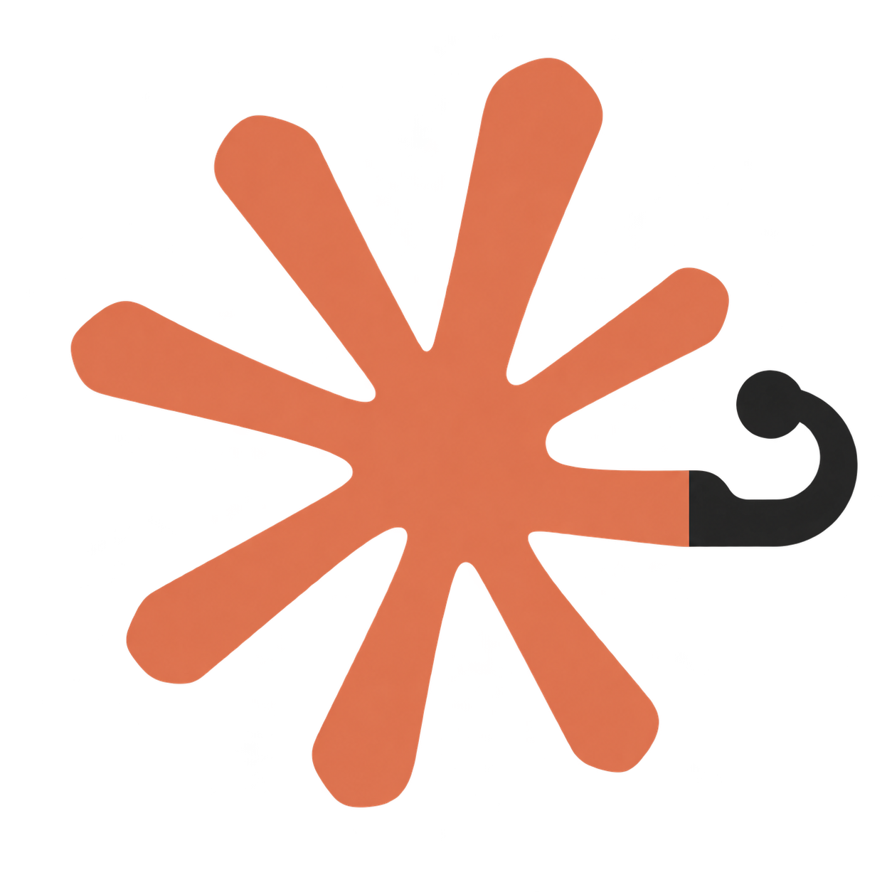

<div align="center">



# control-claude-code

**为 Claude Code 的第三方中转站 API Key 用户提供类原生级别的远程操控体验**

[](https://github.com/DotRacel/control-claude-code/actions/workflows/ci.yml)
[](https://github.com/DotRacel/control-claude-code/actions/workflows/injection-compat.yml)
[](https://www.npmjs.com/package/control-claude-code)
[](https://nodejs.org)
[](LICENSE)

**简体中文** · [English](README.en.md)

</div>

---

支持桌面端与手机端，后端支持自部署以实现隐私保护。

目前已在 Linux 和 macOS 上通过测试。

## 安装

```bash
npm i -g control-claude-code
```

受限于实现方法，本项目对于 Claude Code 的更新是敏感的，因此建议您安装
Claude Code 的稳定版本。

## 使用

```bash
control-claude       # 该命令将代替 `claude` 命令，启动一个受控的 Claude Code
```

当你需要转手到远程操控，只需要像官方订阅用户一样使用 `/rc` 或者 `/remote-control` 命令即可。

项目默认将远程操控提交到后端 `https://ccc.racel.dev`，首次启动你将会被要求设置后端，你可以选定你的自部署后端，
由于我现在部署的后端尚不具备生产要求，因此暂不开放给公众使用。

本项目将配置存储到 `~/.config/control-claude-code/config.json`, 如果你需要重新登录，可以使用 `--login` 参数.

其他参数将会被原样传输给 Claude Code，例如：


```bash
control-claude --resume
control-claude -c --model opus "fix this bug"
control-claude -- --help          # everything after -- is claude's
control-claude --headless         # phone-only, no TUI
```

## 自部署后端

将本项目的 Docker Compose 文件下载，或者干脆直接克隆本项目，然后使用指令启动即可：

```bash
INVITE_CODE=<注册邀请码> docker compose up -d
```

服务器默认部署到 `:8787`，请视需求自行修改。如果不设定环境变量 `INVITE_CODE`，注册将会被关闭。

## 文档与开发

参考文档与本地开发流程请见 [AGENTS.md](AGENTS.md)。

## 许可

[PolyForm Noncommercial 1.0.0](LICENSE)。你可以使用、修改、分享本项目，用于个人使用、学习与研究。
本项目不授予商业使用许可，这也包括在公司内部的使用。`claude` 本身归 Anthropic 所有，
而本项目是面向其产品的一个客户端。
